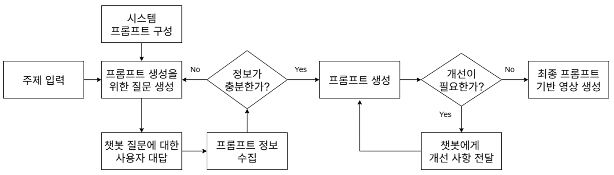

# VPE-Ko

**한국어 기반 Text-to-Video 프롬프트 엔지니어링 시스템 연구: CogVideoX를 중점으로**

A Study on the Text-to-Video Prompt Engineering System Based on Korean: Focusing on CogVideoX

[](https://github.com/wndaasa/VPE-Ko/)

---

## 📖 Abstract

대다수의 Text-to-Video(T2V) AI 모델은 영어 사용을 전제로 연구되고 있기 때문에, T2V 모델 비전문가 혹은 국내 사용자들은 텍스트 프롬프트 작성에 많은 어려움을 겪습니다.

이를 해결하기 위해 본 논문은 **한국어 기반 Text-to-Video 프롬프트 엔지니어링 시스템(VPE-Ko)**을 제안합니다. VPE-Ko는 한국어 대화를 통해 사용자로부터 영상 생성에 필요한 핵심 정보를 수집하여 T2V 모델에 최적화된 프롬프트를 생성하는 시스템입니다.

실험 결과 VPE-Ko는 **G-Eval 4.9**, **프롬프트 만족도 4.5**, **영상 만족도 4.6**을 기록하며 우수한 성능을 보였습니다.

---

## 1. 서론

최근 Text-to-Video(T2V) 생성형 AI 모델의 발전이 활발히 이루어지며 텍스트 프롬프트 엔지니어링의 중요성이 강조되고 있습니다. 하지만 대부분의 T2V 모델은 기본적으로 영어 사용을 전제하고 있으며, 프롬프트 가이드 또한 영어 작성을 권장하고 있습니다. 

이는 한국어가 익숙한 국내 사용자들, 특히 T2V 모델 비전문가들에게 큰 어려움으로 작용합니다.

### 기존 연구의 한계

프롬프트 엔지니어링을 위한 연구는 다방면으로 진행되어 왔으나, **한국어** 혹은 **T2V 모델에 특화된** 프롬프트 엔지니어링 시스템 연구는 많이 부족한 상황입니다.

### 본 논문의 제안

1. T2V 프롬프트의 **핵심 요소를 도출**해 설계한 시스템 프롬프트
2. 프롬프트 엔지니어링을 위한 **한국어 멀티턴 챗봇** 구현

---

## 2. 방법론

### 2.1 VPE-Ko 핵심 요소

본 논문은 오픈소스 T2V 모델 중 프롬프트 이해도가 높으며, 1360×768 고해상도 영상 생성이 가능한 **CogVideoX**를 중심으로 연구했습니다.

공식 문서를 분석해 고품질 영상 생성을 위한 5가지 핵심 요소를 도출했습니다:

| 핵심 요소 | 예시 |
|----------|------|
| **주요 객체** | 건물, 사람, 동물 등 |
| **카메라 구도** | 전경을 담는 구도, 특정 객체에 집중한 구도 등 |
| **카메라 종류** | 드론, 1인칭 카메라 등 |
| **영상의 속도** | 느린 속도, 빠른 속도 등 |
| **조명** | 자연광, 네온 조명 등 |

### 2.2 데이터셋 구축

VPE-Ko 핵심 요소에 중점을 둔 한국어 대화 데이터셋을 자체 생성하여 연구를 진행했습니다.

- 두 개의 챗봇에 각각 **Assistant**와 **User** 역할을 부여한 뒤 자연스럽게 대화시켜 구축
- Assistant는 VPE-Ko 시스템 역할로 핵심 요소를 수집
- User는 VPE-Ko 사용자로서 핵심 요소 정보를 제공
- **5,000개의 대화 내용** 및 **24,769건의 한국어 대화쌍** 데이터셋 생성
- 데이터셋 구축을 위한 챗봇은 ChatGPT-API를 사용

### 2.3 시스템 프롬프트 설계

VPE-Ko 시스템 프롬프트는 멀티턴 챗봇의 지시문으로 사용되며, 설계 방향성은 다음과 같습니다:

1. VPE-Ko 핵심 요소의 체계적인 수집을 위한 **순차적 질문 전략** 설계
2. VPE-Ko 핵심 요소 외에도 키워드 가중치, 부정 프롬프트 등 **일반적인 프롬프트 가이드** 포함
3. T2V 프롬프트 스타일 분석을 위한 **Few-Shot 예시 프롬프트** 제시
4. 영어 프롬프트, 한국어 번역 프롬프트, 부정 프롬프트, 개선 사항 제안의 **4가지 표준 출력 형식** 제안

### 2.4 멀티턴 챗봇 시스템

VPE-Ko 멀티턴 챗봇 시스템은 사용자와의 연속적인 한국어 대화를 기반으로 고품질 영어 프롬프트를 생성합니다.

- **Qwen2** 언어 모델을 활용
- 이전 대화 내용 전체를 다음 입력값으로 사용하여 멀티턴 구현
- 핵심 요소를 충분히 수집했다고 판단하면 **4가지 출력**을 생성
- 사용자는 구어체 대화를 통해 피드백을 전달하고, VPE-Ko는 이를 반영하여 개선된 프롬프트 생성



---

## 3. 실험

### 3.1 실험 설계

VPE-Ko 시스템의 유효성을 검증하기 위해 **A-B 테스트**를 진행했습니다.

- 실험 참가자: T2V 모델 사용 경험이 없는 한국인 10명
- **프롬프트 A**: 실험 참가자가 직관적으로 작성한 프롬프트
- **프롬프트 B**: VPE-Ko 시스템을 활용해 생성한 프롬프트
- 각 프롬프트를 CogVideoX 모델에 입력하여 **영상 A', B'** 생성

### 3.2 평가 방법

1. **G-Eval**: 생성형 AI 평가에 특화된 지표를 사용한 객관적 평가
2. **사용자 만족도 조사**: 프롬프트 및 영상에 대한 5점 만족도 조사

### 3.3 실험 결과

| 평가 항목 | 사용자 직접 작성 (A) | VPE-Ko 기반 (B) |
|----------|:-------------------:|:---------------:|
| **G-Eval** | 3.6 | **4.9** |
| **프롬프트 만족도** | 3.6 | **4.5** |
| **영상 만족도** | 2.1 | **4.6** |

### 3.4 대표 예시

| 구분 | 프롬프트 |
|------|---------|
| **A (사용자 작성)** | 뜨겁게 타오르는 화산 |
| **B (VPE-Ko)** | A scorching volcano erupts in a breathtaking display of fiery majesty, its molten lava (flowing down:2.0) the mountain's sides like a river of liquid fire. From above, the camera captures the scene in sweeping aerial shots, emphasizing the scale and intensity of the eruption. The natural light bathes the landscape in an ethereal glow, highlighting the (crimson flames:1.8) that dance and flicker against the night sky. |

- 프롬프트 A는 매우 짧고 정보가 단편적
- 영상 A'는 CogVideoX가 이해하지 못하는 한국어 문장을 기반으로 하기 때문에 프롬프트와 무관한 영상 생성
- 프롬프트 B는 5가지 핵심 요소가 포함되어 사용자의 의도가 상세하게 반영됨
- 영상 B'는 사용자의 생각과 의도를 그대로 반영

---

## 4. 결론

본 논문은 한국어 기반 T2V 프롬프트 엔지니어링 시스템 **VPE-Ko**를 제안합니다.

해당 시스템은 LLM 기반 시스템 프롬프트와 멀티턴 챗봇 구조를 활용하여 효과적인 프롬프트 엔지니어링 환경을 제공합니다. 이를 위해 CogVideoX 프롬프트 핵심 요소를 도출하고, 2개의 LLM으로 생성한 **24,769건의 한국어 대화쌍 데이터셋**으로 Qwen2를 학습시켰습니다.

VPE-Ko 기반 프롬프트가 **G-Eval 4.9점**, **사용자 만족도 4.5점**을 기록했으며, 특히 **생성된 영상 만족도 4.6점**을 달성하며 매우 유효한 연구임을 증명했습니다.

따라서 한국어 대화 기반 고품질 영어 프롬프트를 생성하는 VPE-Ko 시스템은 한국어에 익숙한 T2V 비전문가에게 큰 도움이 될 수 있으며, 더 나아가 다양한 영상 생성 AI 모델에도 적용될 수 있을 것으로 기대됩니다.

---

## 📝 Citation

```bibtex
@inproceedings{lim2025vpeko,
  title={한국어 기반 Text-to-Video 프롬프트 엔지니어링 시스템 연구: CogVideoX를 중점으로},
  author={임영기 and 최지희 and 엄태선 and 이우성 and 구영현},
  booktitle={한국인공지능학회},
  year={2025}
}
```

---

## 🙏 Acknowledgments

본 논문은 2025년도 정부(과학기술정보통신부)의 재원으로 정보통신산업진흥원의 지원을 받아 수행되었습니다.

---

## References

1. Sarkar, R., et al. (2025). Conversational user-ai intervention: A study on prompt rewriting for improved llm response generation.
2. Ein-Dor, et al. (2024). Conversational prompt engineering.
3. Zhang, C., Dai, et al. (2025). A survey on multi-turn interaction capabilities of large language models.
4. 손민준, & 이성진. (2025). 대규모 언어 모델에서 프롬프트 엔지니어링 기법에 관한 연구.
5. Yang, Z., et al. (2024). Cogvideox: Text-to-video diffusion models with an expert transformer.
6. Team, Q. (2024). Qwen2 technical report.
7. Liu, Y., et al. (2023). G-eval: NLG evaluation using gpt-4 with better human alignment.
